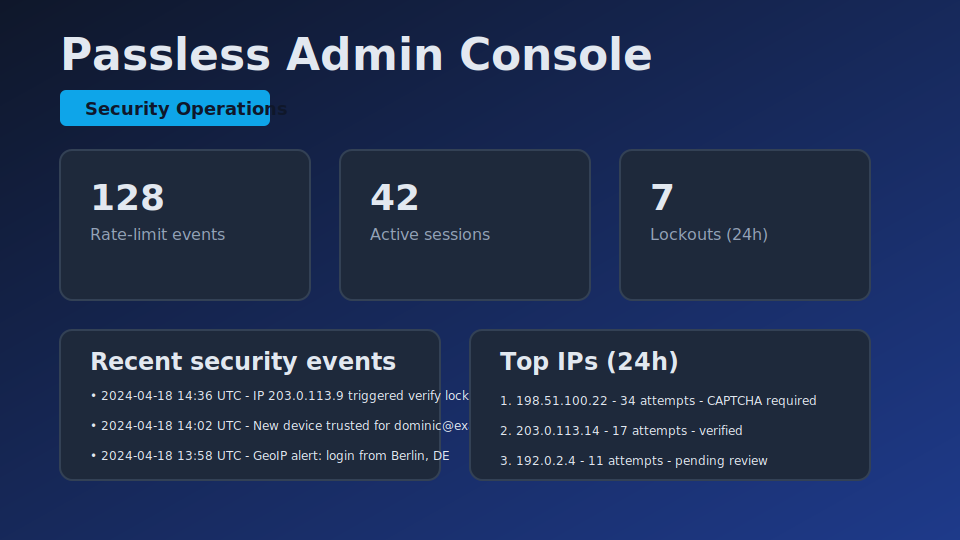
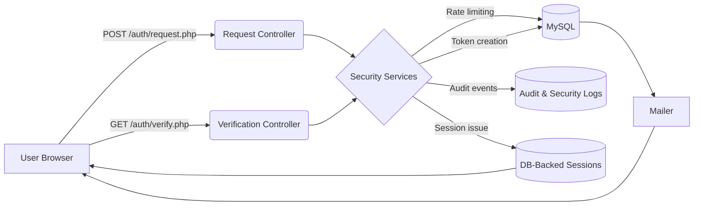

# Passless

**Passwordless authentication engineered from first principles — secure magic links, airtight rate limiting, and observable identity flows without frameworks.**

[🔗 **Live Demo**](https://lab.minischetti.org/passless)

---

## Overview
Passless is a complete passwordless authentication system built to show what robust, production-ready identity looks like **without relying on Laravel, Symfony, or security frameworks**.

It’s intentionally minimal, portable, and auditable. Every component — tokens, rate limits, sessions, CSRF, CAPTCHA, fingerprinting, audit logs — is implemented directly in PHP to make the architecture fully transparent.

Runs anywhere: shared hosting, containers, bare metal, or cloud platforms.

---

## Features

### 🔐 Strong Authentication
- Magic links hashed + fingerprint-bound (IP + User-Agent)
- Single-use tokens with transactional verification
- Account unlocks and session refresh on successful login

### 🛡 Abuse Prevention
- Multi-dimensional rate limits (email, IP, email+IP)
- Progressive CAPTCHA after thresholds
- Account lockouts & security notifications
- Randomized failure delays to reduce timing analysis

### 📜 Auditability & Tracking
- Append-only audit logs
- Structured security events
- GeoIP change alerts
- Admin console with realtime activity and risk indicators

### 🧵 Sessions & State
- Database-backed sessions with:
  - Sliding expiration
  - Absolute expiration
  - Device metadata
  - Self-service session revocation
- CSRF protection with rotating tokens

### 🧪 Tooling & Quality
- Unit + integration tests (SQLite replicas of MySQL tables)
- PHPStan (level 7)
- Docker Compose environment
- Automated deployments via GitHub Actions

---

## Tech Stack
- **PHP 8** (framework-free, PDO)
- **MySQL 8** (SQLite for testing)
- **Vanilla JS** + modern CSS
- **SendGrid / Mailgun** for transactional mail
- **GitHub Actions**, Docker Compose, PHPStan

---

## Design Philosophy
This system is built to thrive in **constraints**:

- No npm, no build toolchains
- No frameworks
- Only core PHP extensions
- Works on FTP-only shared hosting
- Scales up cleanly to containers and cloud

If an architecture functions under severe constraints, it remains reliable anywhere.

---

## Technology Choices (Rationale)

- **Vanilla PHP** → transparent logic, small attack surface
- **MySQL** → atomic UPSERTs, universally available
- **Magic links** → no password storage, low-friction onboarding
- **Server-side sessions** → simple revocation, CSRF pairing, predictable security

---

## Why Passless Exists
A practical demonstration of:

- Token hashing, fingerprinting, rate limiting, CSRF, audit trails
- Clean database schemas for auth + security + observability
- Fully transparent control flow, ideal for interviews or teaching
- A real deployment used as a reference implementation

**Note:** For production-scale workloads, SaaS identity providers (Auth0, Clerk, Supabase) may be more appropriate unless compliance, cost, or vendor policy prevents it.

---

## When to Use SaaS vs. Passless

### Choose **Auth0 / Clerk / Supabase** when:
- You need OAuth/social login
- You want dashboards, MFA, analytics, and SLAs out of the box
- Team velocity and convenience matter most

### Choose **Passless-style in-house** when:
- Air-gapped or compliance-restricted environments
- Need custom audit logs & forensics
- Vendor pricing scales poorly with MAU
- You want to demonstrate security fundamentals

---

## Installation
1. Clone the repository:
   ```bash
   git clone https://github.com/your-org/passless.git
   cd passless
   ```
2. Copy the environment template and edit values:
   ```bash
   cp .env.example .env
   ```
3. Create a MySQL database (UTF8MB4).

4. Import schema:
   ```bash
   mysql -u <user> -p <database> < htdocs/database/install.sql
   ```
5. Ensure PHP extensions:
   pdo_mysql, openssl, mbstring, curl, json, session, pdo_sqlite (tests)

6. Make htdocs/ the document root (or upload only that folder).

7. Optional local stack:
   ```bash
   docker compose up --build
   ```
   Starts PHP 8.2 + MySQL + Mailpit on https://localhost:8443.

### Configuration
Minimum required:
   ```
   APP_ENV=production
   APP_URL=https://your-domain/passless
   DB_HOST=
   DB_NAME=
   DB_USER=
   DB_PASS=
   MAIL_PROVIDER=
   MAIL_FROM=
   SENDGRID_API_KEY or MAILGUN_*
   ```
All other .env.example variables have safe defaults for security, sessions, rate limits, CAPTCHA, and GeoIP.

Usage
- **Request link**: Submit email on /.
   Dev mode shows link in browser
   Production sends via email
- **Verify link**:
   /auth/verify.php enforces hashing, fingerprint, rate limits, lockouts.
- **Dashboard**: /app.php
   Active sessions, device metadata, events, revocation.
- **Admin console**: /admin.php
   Suspicious IPs, rate-limit pressure, failed attempts, lockouts.
- **Automation**:
   php htdocs/deploy/cleanup.php removes expired tokens/sessions/limits.
- **Testing:
```
php tests/run.php
php phpstan.phar analyse --configuration=phpstan.neon
```

## Gallery



## Architecture


## Performance Characteristics
- Benchmarked on a 2-core Codespaces VM (SQLite harness, bcrypt cost 10):
- Magic link request: ~1.6 ops/s
- Verification: ~1.6 ops/s
- Rate limit UPSERTs: ~25k ops/s (SQLite in-memory)

These are intentionally conservative because password hashing is slow by design.

For throughput:

- Switch to Argon2id
- Move rate limits to Redis
- Horizontal PHP scaling (sessions already persistent)

Reproduce:

```
php tools/load_test.php
```
## Key Learnings
- Atomic UPSERTs remove race conditions without Redis
- Layering mitigations (fingerprint + throttling + lockouts) prevents single-point failures
- Magic links are simple UX-wise but require careful state management
- Bcrypt cost tuning is a tradeoff: UX vs. threat model
- Designing for shared hosting enforces discipline that scales upwards

## Testing & Quality Assurance
- **Unit tests:** TokenService, RateLimiter, CSRF token handling.
- **Integration tests:** Full request → verify → session flows using SQLite fixtures.
- **Static analysis:** PHPStan level 7.
- **Security simulations:** Rate-limit exhaustion, fingerprint mismatch, and replay attempts.

Run all:
```bash
php tests/run.php
```
## Security Audit Checklist
- [x] Hashed magic links (bcrypt)
- [x] Fingerprint binding (IP + UA)
- [x] Secure, HttpOnly, SameSite cookies
- [x] CSRF tokens on state-changing requests
- [x] Email/IP/combined rate limits
- [x] Account lockouts\
- [x] Append-only logs
- [x] GeoIP anomaly alerts
- [x] No plaintext secrets in repo

## Abuse Prevention Layers
- Multi-scope rate limiting
- Progressive CAPTCHA
- Token fingerprint binding
- Account lockouts
- GeoIP alerts

## Monitoring & Observability
- Structured JSON logs (lib/Support/Log.php)
- Security event stream
- Admin console risk indicators
- Integrations possible: Sentry / Datadog / Prometheus

## Scalability & Limitations
- Indexed expiration fields for tokens/sessions/logs
- Horizontal scaling requires sticky sessions or Redis-backed sessions
- Cleanup via deploy/cleanup.php
- GeoIP cached 7 days

## Production Considerations
- Future enhancements for large workloads:
- Redis rate limiter / session cache
- WebAuthn or TOTP
- Device-bound session attestations
- Prometheus/OpenTelemetry metrics
- Lightweight framework integration (optional)

All omitted intentionally here to keep the project fully framework-free.

## Project Structure
```
passless/
├── htdocs/
│   ├── index.php
│   ├── app.php
│   ├── admin.php
│   ├── assets/
│   ├── auth/
│   ├── lib/
│   ├── database/
│   ├── deploy/
│   └── .htaccess
├── tests/
├── tools/
├── docs/
├── docker-compose.yml
└── .env.example
```

## Troubleshooting
- **No email?** Check provider API keys and outbound HTTP.
- **Blocked by rate limit?** Clear rate_limits table or lower thresholds.
- **Missing session cookie?** Check HTTPS + cookie domain settings.
- **FTP deploy failing?** Verify passive mode + firewall.
- **GeoIP errors?** Disable or update endpoint.
- **Docker TLS warnings?** Trust or replace the self-signed cert.

## Roadmap
- WebAuthn & TOTP
- Redis-backed rate limiting
- Disposable email domain checks
- Automated coverage reports
- Prometheus/Grafana dashboards

## License
MIT License.

## Author
Dominic Minischetti
